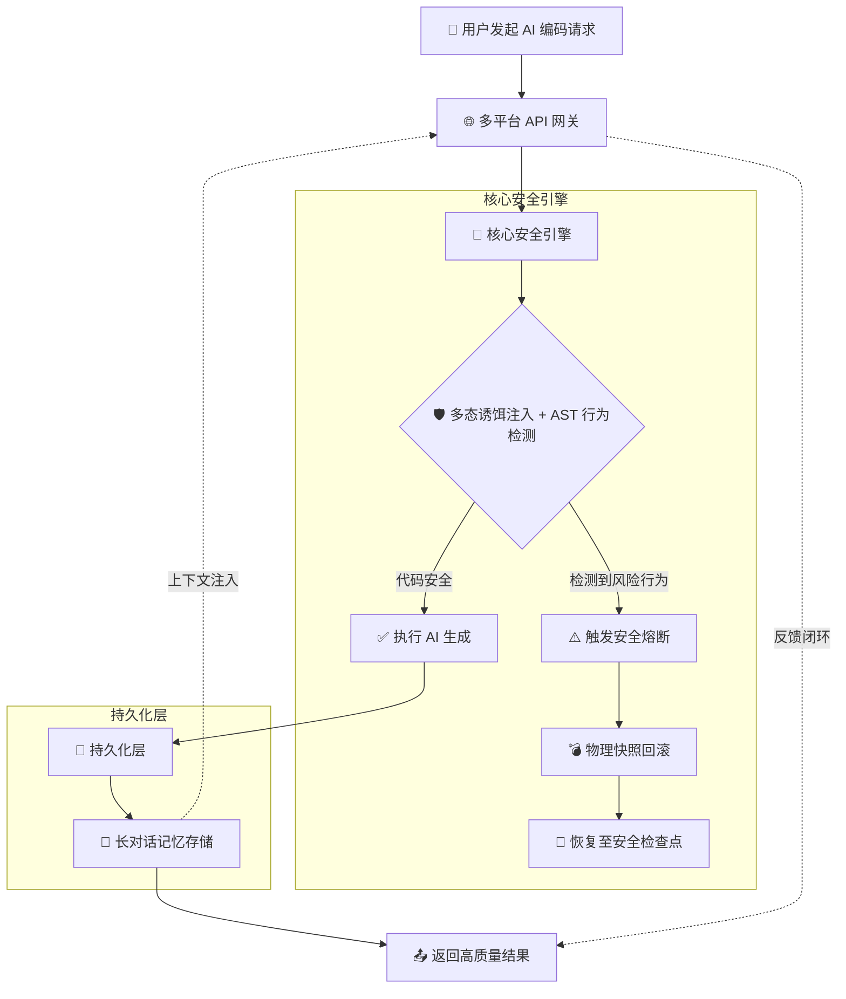

# 我是金呈

> 多谢大家来我的仓库玩。

---

## 项目：Word 体系 —— AI 行为约束与治理工具集

**让 AI 按规矩干活，违规就回滚。一套可审计、可对抗、可落地的 AI 治理方案。**

表面上看，这是一套"AI 治理工具集"。实际上就干一件事：

> **帮你省 token，顺便让 AI 少干蠢事。**

---

## ✨ 核心能力一览

| 能力 | 一句话说明 |
|------|-----------|
| 🧪 多态诱饵 + AST 行为检测 | 注入诱饵看 AI 会不会上当，AST 精确判断真假修复 |
| 💾 物理快照与安全回滚 | 改之前先拍照，翻车了一键还原 |
| 🧠 长对话记忆（SimHash） | 聊 100 轮不失忆，话题切换自动感知 |
| 📖 硬核叙事创作（诗云） | 30+ 题材库 + 维度审讯 + 场景卡，一次出好稿 |
| 📊 B 端交付层（POC 报告） | HTML + JSON 双格式，支持批量，便于审计展示 |
| 🔌 10+ AI 平台适配 | DeepSeek / OpenAI / Claude / Gemini / Ollama 等 |
| 🔭 GitHub 侦察兵 | 从链接 + 对话自动生成项目地图，AI 不再瞎编路径 |
| 💰 省 Token 设计 | 每次请求省 ~7770 token，折合 ~60 元/月 |

---

## 🏗️ 系统架构



---

## 📁 目录结构

```
jinchen/
├── Toolkit/                      # 🚀 所有核心模块
│   ├── __init__.py
│   ├── gateway.py                # 统一网关（L1-L5 五层路由 + 反馈式重试）
│   ├── work.py                   # 核心守门（13 条 Python AST 规则）
│   ├── guardian.py               # 快照回滚 + 审计日志（RollbackJury）
│   ├── Archive.py                # 长对话记忆（SimHash 64 位）
│   ├── shiyun.py                # 硬核叙事工厂（30+ 题材库）
│   ├── Nuwa.py                  # POC 报告 + 辐射检测 + 关系图谱
│   ├── github_scout.py          # 🔭 GitHub 项目侦察兵
│   ├── enhancements.py           # 增强功能集合
│   └── skills/                  # Skill 定义文件（7 个）
├── examples/                     # 📚 使用示例（5 个）
├── config/                       # 配置模板
├── evaluate.py                   # 📊 准确率评估框架
├── verify.py                     # ✅ 147 项单元测试
├── verify_real.py                # 🔍 真实项目扫描框架
├── verify_scout.py              # ✅ Scout 专项测试
├── INTRO.md                     # 📖 完整项目介绍
├── CHANGELOG.md                 # 📜 更新公告
├── CONTRIBUTING.md              # 🤝 贡献指南
├── requirements.txt              # Python 依赖
├── .gitignore                   # Git 忽略规则
└── LICENSE                      # MIT
```

---

## 🚀 快速开始

```bash
# 1. 克隆仓库
git clone https://github.com/jincheng3870682453-hash/jinchen.git
cd jinchen

# 2. 安装依赖
pip install -r requirements.txt

# 3. 配置 API Key
export NUWA_AI_API_KEY=sk-你的真实key
export NUWA_AI_PROVIDER=deepseek

# 4. 跑验证（147/147 全过）
python3 verify.py

# 5. 看省 Token 效果
python3 examples/04_token_saving.py
```

---

## 💰 省 Token 设计（核心卖点）

> **不把不需要的东西发给模型，不把同样的上下文发第二遍。**

| 模块 | 省 Token 逻辑 |
|------|---------------|
| **Archive.py** | 不把 10 轮历史全塞给模型，只挑最近相关的 3 条。**省 40%~70%。** |
| **work.py** | 模型写出垃圾 → 只告诉它"第 3 行少了 try-catch"。**不让它反复烧钱。** |
| **shiyun.py** | 结构化场景卡喂 AI，一次出好稿。**不靠碰运气省几万 token。** |
| **gateway.py** | 意图识别 → 只加载相关 Skill。**不把 7 个全塞进 prompt。** |
| **guardian.py** | 翻车了一键还原。**不用让 AI "再试试"又烧一轮。** |
| **github_scout.py** | 从对话里捞路径 → AI 不瞎编。**不浪费一轮重写。** |

### 数字说话

| 环节 | 裸调 AI | 用这套工具 | 省 |
|------|---------|------------|-----|
| 上下文（10 轮历史） | ~8000 | ~2500 | **~5500** |
| Skill 注入（7 选 1~3） | ~2000 | ~500 | **~1500** |
| 重试（发全文 vs 发差异） | ~800 | ~30 | **~770** |
| **单次请求合计** | **~10800** | **~3030** | **~7770** |

> 每次请求省 **~7770 token** ≈ 0.02 元/次 → 一天 100 次 = **60 元/月**
>
> **但真正值钱的不是这 60 块钱——是"模型一次出对"省下的那几个小时调试时间。**

---

## 🔭 GitHub 侦察兵（github_scout.py）

### 它解决什么问题？

> **AI 最大的困境不是"不会写代码"，是"看不见你的项目"。**

用户说"帮我改一下 login.py"，AI 不知道这个文件在哪、长什么样，只能瞎编路径。

### 它怎么工作的？

```
用户给了 GitHub 链接 + README 里有目录结构
        ↓
github_scout 自动解析链接 → 拼出 raw URL
        ↓
从对话/README 里捞文件路径 → Toolkit/gateway.py
        ↓
自动拼 URL → https://raw.githubusercontent.com/user/repo/main/Toolkit/gateway.py
        ↓
requests.get() 拉取 → 缓存到本地
        ↓
生成项目地图 → 注入 AI 的 prompt
        ↓
AI 拿到后："我修改 Toolkit/guardian.py 的 _create_snapshot 函数..."
        ↓
✅ 路径正确，代码对得上！
```

### 三种使用方式

```python
from Toolkit.github_scout import GithubScout

# 方式 1：直接给 GitHub 链接
scout = GithubScout("https://github.com/user/repo")
scout.parse_structure(readme_text)
scout.fetch_all()
prompt = scout.to_prompt()

# 方式 2：从对话历史自动提取
scout.parse_multiple(conversation_messages)
prompt = scout.build_system_context()

# 方式 3：一键快速扫描
result = GithubScout.quick_scan(repo_url, conversation)
# 搜到了 → 返回项目地图
# 搜不到 → 返回反问："请问文件在哪个文件夹？"
```

### 搜不到怎么办？自动反问

```python
question = scout.build_followup_question()
# 为了帮你准确定位文件，请补充以下信息：
# 1. utils.py 在哪个文件夹里？
# 2. 你的项目用的是哪种语言/框架？
# 3. 方便的话，贴一下你的目录结构？
```

---

## 🤝 客户痛点 vs 实际解法

| 客户原话 | 实际解法 | 评级 |
|----------|---------|------|
| "AI 写代码不靠谱" | 13 条 AST 规则 + 反馈式重试 | ✅ 真有用 |
| "AI 聊久了就失忆" | SimHash 长对话记忆 + 主题切换检测 | ✅ 真有用 |
| "AI 瞎编文件路径" | GitHub 侦察兵 + 项目地图注入 | ✅ 真有用 |
| "AI 太费 token 了" | 全模块协同省 Token | ✅ **核心价值** |
| "AI 写小说没深度" | 30+ 题材库 + 审讯维度 + 场景卡 | ✅ 真有用 |
| "回滚了不知道为啥" | RollbackJury 生成判决书 | ✅ 真有用 |
| "我们写 Java/Swift" | 当前只支持 Python | 🔴 等 tree-sitter |

---

## ⚠️ 局限性说明（必读）

| 项目 | 说明 |
|------|------|
| **只做 Python** | V3.2 砍掉了 Java/Kotlin/TS/Swift 正则检测，专注把 Python AST 磨到极致。其他语言等 tree-sitter。 |
| **审计日志非防篡改** | SHA-256 只是本地完整性校验，不是密码学签名。需防篡改请配 Sigstore。 |
| **意图识别是轻量级** | 默认关键词匹配，可选装 sentence-transformers 升级语义匹配。 |
| **Mock 模式已移除** | API 失败直接抛异常，绝不拿假数据冒充 AI 输出。 |
| **Scout 需要网络** | github_scout 通过 raw.githubusercontent.com 拉文件，离线无法使用。 |

---

## 📊 准确率评估

```
精确率 (P):   70.59%
召回率 (R):   75.00%
F1 分数:      72.73%
误报率 (FPR): 33.33%
```

> 数据集目前 15 条标注样本，欢迎贡献更多。

---

## 🌐 支持的 AI 平台

| 平台 | 类型 | 状态 |
|------|------|------|
| DeepSeek | 云端 | ✅ 最常用，推荐起步 |
| OpenAI | 云端 | ✅ 接口已写 |
| Anthropic (Claude) | 云端 | ✅ 接口已写 |
| Gemini | 云端 | ✅ 接口已写 |
| 通义千问 | 云端 | ✅ 接口已写 |
| 智谱 GLM | 云端 | ✅ 接口已写 |
| Ollama | **本地** | ✅ 零成本，无需 API Key |
| MiniMax / 百川 / 腾讯混元 | 云端 | ✅ 接口已写 |

切换平台只改一行：`export NUWA_AI_PROVIDER=deepseek`

---

## 📄 许可证

MIT License —— 随便用，出事了别找我（开玩笑的，Issue 随时提）。

---

## 🙏 致谢

- `requests` —— 没有你就没有 HTTP
- `sentence-transformers` —— 让关键词匹配有了退路
- 所有 AI 服务商 —— 感谢提供 API（和偶尔的限流）
- DeepSeek —— 感谢帮我 Review 代码（虽然建议只采纳了一半）

---

**让 AI 守规矩，从承认不完美开始。 🛡️**

**顺便帮你省 token —— 不烧不该烧的，就是赚到的。** 💰

---

> 📧 **联系我**：jincheng3870682453@gmail.com
>
> 🔗 **仓库地址**：https://github.com/jincheng3870682453-hash/jinchen
>
> **继续建造。** 🔨
