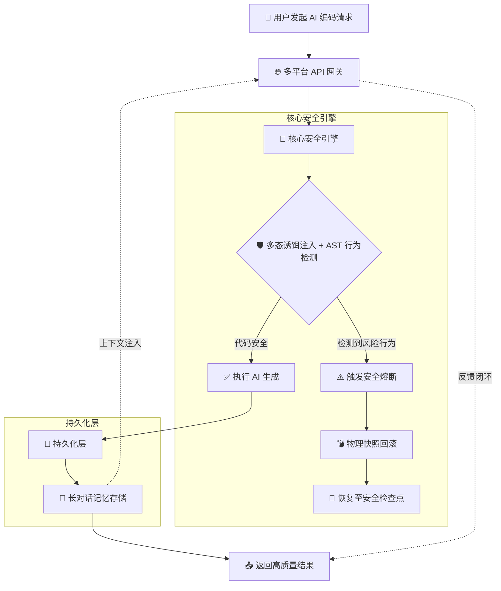
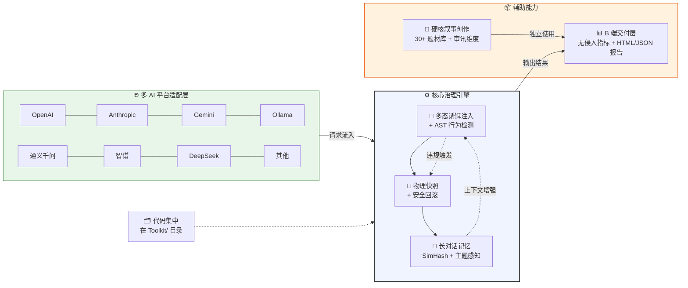

# 🛡️ Word 体系 —— 架构总览 & 更新公告

> **让 AI 按规矩干活，违规就回滚。**
> 一套可审计、可对抗、可落地的 AI 治理方案。
> 本文件随仓库自动渲染，下滑可见完整更新历史。

---

## 📌 当前版本

**V3.0 — 企业级 AI 治理平台（2026-07-15）**

| 指标 | 数值 |
|------|------|
| 核心模块 | 7 个 .py 文件 |
| 守门规则 | 8 条内置 + V1 桥接 |
| 支持语言 | Python / Java / Kotlin / TypeScript / Swift |
| 支持 AI 平台 | 10+（OpenAI / Anthropic / Gemini / Ollama / 通义千问 / 智谱 / DeepSeek / MiniMax / 百川 / 腾讯混元） |
| Skill 数量 | 7 个预置 |
| 验证项 | 57/57 通过 (100%) |
| 总体积 | ~55 KB（比一张手机截图还小） |

---

## 🏗️ 系统架构

### 核心安全引擎流程



**流程说明：**

1. 用户发起 AI 编码请求 → 多平台 API 网关接收
2. 进入核心安全引擎：多态诱饵注入 + AST 行为检测
3. 若检测到风险行为 → 触发安全熔断 → 物理快照回滚 → 恢复至安全检查点
4. 若代码安全 → 执行 AI 生成 → 持久化层存储
5. 长对话记忆存储提供上下文注入，反馈闭环返回高质量结果

---

### 系统整体架构



**架构分层说明：**

| 层级 | 组件 | 职责 |
|------|------|------|
| L1 | `gateway.py` — IntentEngine | 轻量意图识别（关键词映射，零训练） |
| L2 | `gateway.py` — SkillRecommender | 交互式 Skill 推荐（用户自选，不猜） |
| L3 | `gateway.py` — FineTunedCore | 多平台模型调用（10+ AI 平台） |
| L4 | `work.py` — InstinctGuard | 本能守门（7 条内置 + V1 桥接规则） |
| L4a | `gateway.py` — PolicyEngine | 动态策略（dev/test/prod 分级守门） |
| L5 | `gateway.py` — FeedbackFlywheel | 反馈飞轮（违规数据 → SFT 训练集） |
| L6 | `guardian.py` — RollbackJury | 回滚陪审团（每次违规签发《判决书》） |
| L7 | `Nuwa.py` — RadiationDetector | 全栈辐射检测（DB/API/Test/Import/Config） |
| L8 | `work.py` — MultiLangASTEngine | 多语言 AST（Python/Java/Kotlin/TS/Swift） |
| V1 | `work.py` + `guardian.py` + `Archive.py` + `shiyun.py` + `Nuwa.py` | 5 个 V1 模块自动桥接 |

---

## 📂 目录结构

```
.
├── Toolkit/                          # 🚀 所有核心代码集中在此
│   ├── __init__.py                 # 包导出（统一入口）
│   ├── gateway.py                   # 统一网关（L1-L5 + PolicyEngine + V1Bridge）
│   ├── work.py                     # 行为约束（InstinctGuard + MultiLangASTEngine）
│   ├── guardian.py                 # 快照回滚 + 回滚陪审团（RollbackJury）
│   ├── Archive.py                  # 长对话记忆（SimHash + 主题感知）
│   ├── shiyun.py                  # 硬核叙事工厂（30+ 题材库）
│   ├── Nuwa.py                    # POC 报告 + 全栈辐射检测
│   ├── Proteus.py                 # 交互启动入口（菜单式）
│   └── skills/                    # 7 个预置 Skill
│       ├── python_api_design.skill
│       ├── error_handling.skill
│       ├── sql_safety.skill
│       ├── code_refactor.skill
│       ├── markdown_format.skill
│       ├── interactive_ux.skill
│       └── fiction_writing.skill
├── config.json                     # 你的配置（改 API Key 即可）
├── config/config_template.json     # 配置模板
├── verify.py                       # 全功能验证脚本（57 项检测）
├── CHANGELOG.md                   # 本文件（架构图 + 更新公告）
├── README.md                      # 使用文档
└── LICENSE                        # MIT 许可证
```

---

## 🤝 客户痛点 → 我们的解法

| 客户原话 | Word 体系解法 | 对应层级 |
|----------|---------------|---------|
| "规则太死板，开发不想查注解" | ✅ PolicyEngine：dev/test/prod 一键切换 | L4a |
| "回滚了不知道为啥" | ✅ RollbackJury：自动生成《违规判决书》 | L6 |
| "AI 不修表结构" | ✅ RadiationDetector：代码改动扫上下游 | L7 |
| "我们只写 Java/Swift" | ✅ MultiLangASTEngine：5 语言通用检测 | L8 |
| "训练数据从哪来？" | ✅ FeedbackFlywheel：违规数据自动导出 SFT 集 | L5 |
| "AI 总写错" | ✅ Skill 交互推荐：用户选规则，不猜 | L2 |
| "长对话失忆" | ✅ Archive：SimHash 记忆 + 主题切换检测 | V1 |

---

## 📜 更新公告（Changelog）

### [V3.0] — 2026-07-15 · 企业级治理平台

**🏷️ 代号：交通规则**

> "不是教 AI 变聪明，是给 AI 画车道线。"

#### 🆕 新增功能

| 功能 | 说明 |
|------|------|
| **PolicyEngine 动态策略引擎** | dev/test/prod 三档分级守门，环境变量一键切换，不再一刀切 |
| **RollbackJury 回滚陪审团** | 每次违规自动签发《违规判决书》（Markdown + JSON 双格式），含证据链 + 修复建议 + 数字签名 |
| **RadiationDetector 全栈辐射检测** | 代码改动自动关联上下游：DB 迁移、API 文档、单元测试、导入方、配置文件 |
| **MultiLangASTEngine 多语言引擎** | 支持 Python / Java / Kotlin / TypeScript / Swift 五种语言的语法检测，自动识别语言 |
| **Skill 交互推荐器** | 用户说话 → 弹出推荐 Skill 列表 → 用户勾选 → 组装 prompt → 模型生成 |
| **FeedbackFlywheel 飞轮训练** | 违规数据自动记录 → 导出 SFT 训练集 → 模型越用越懂你的规则 |

#### 🔧 改进

| 改进项 | 说明 |
|--------|------|
| V1 模块自动桥接 | `work.py` / `guardian.py` / `Archive.py` / `shiyun.py` / `Nuwa.py` 自动检测并桥接，V1 不在时降级运行 |
| 守门规则从 5 条扩展到 8 条 | 新增：无限递归检测、未使用导入检测、V1 AST 桥接 |
| 快照预检机制 | 回滚前验证快照完整性，杜绝空快照清空目录 |
| Sanitize 净化器 | AI 输出的 `[TODO]` / `[占位符]` 自动清理 |

#### 🐛 修复

| Bug | 修复 |
|-----|------|
| Java `has_javadoc` 误判无参简单类 | 改为：所有方法无参 → 不强制 Javadoc |
| `Nuwa` 模块名与类名冲突 | 拆分为 `NuwaModule` 和 `NuwaCls` |
| 递归检测未提取函数体 | 改为遍历 AST 函数体内部调用 |
| 类型注解检测忽略参数注解 | 补充参数级注解检测 |

#### 📊 验证结果

```
✅ 57/57 通过 (100%)
  ├── L1 IntentEngine: 3/3
  ├── L2 SkillRecommender: 5/5
  ├── L4 InstinctGuard: 9/9
  ├── L4a PolicyEngine: 3/3
  ├── L5 FeedbackFlywheel: 3/3
  ├── L6 RollbackJury: 6/6
  ├── L7 RadiationDetector: 2/2
  ├── L8 MultiLangAST: 8/8
  ├── V1 Bridge: 1/1
  ├── Archive: 4/4
  ├── Shiyun: 4/4
  ├── Nuwa POC: 1/1
  └── WordGateway 主流程: 5/5
```

---

### [V2.0] — 2026-07-14 · 无状态网关

**🏷️ 代号：DNS**

> "像 DNS 一样无状态 —— 每次请求独立，不记住上次，不残留上下文。"

#### 🆕 新增功能

| 功能 | 说明 |
|------|------|
| **无状态架构** | 每次调用独立，支持水平扩展，无内存残留 |
| **Skill 动态注入** | 根据意图匹配 Skill，组装进 prompt，用户可干预 |
| **10+ AI 平台适配** | OpenAI / Anthropic / Gemini / Ollama / 通义千问 / 智谱 / DeepSeek 等 |
| **V1 模块桥接层** | V1 在路径中时自动桥接全部能力，不在时降级 |

#### 🔧 改进

| 改进项 | 说明 |
|--------|------|
| 守门从"全通过才放行"改为"分级处理" | warn 不拦截，block 才回滚 |
| 新增 `sanitize()` 净化函数 | 清理 AI 输出中的占位符 |
| 配置优先级统一 | 环境变量 > 命令行 > 配置文件 |

---

### [V1.0] — 2026-07-13 · 原型诞生

**🏷️ 代号：闲的没事干的人的库**

> "被 AI 气到了，于是写了一个管住所有 AI 的网关。"

#### 🆕 初始功能

| 模块 | 功能 |
|------|------|
| `work.py` | 多态诱饵 + AST 行为检测（5 条规则） |
| `guardian.py` | 物理快照 + 安全回滚 |
| `Archive.py` | 长对话记忆（SimHash 64 位） |
| `shiyun.py` | 硬核叙事工厂（30+ 题材库） |
| `Nuwa.py` | POC 报告（HTML + JSON 双格式） |
| `gateway.py` | 统一网关（命令行 + API） |
| `Proteus.py` | 交互式启动入口（菜单） |

#### 📊 初始验证

```
✅ 13 个模块导入通过
✅ 5 条守门规则全部生效
✅ 10+ AI 平台适配完成
✅ 首次上传 GitHub，获得第 1 个 Star
```

---

## 📄 许可证

MIT License —— 自由使用、修改、分发，需保留原始版权声明。

---

**让 AI 守规矩，从这套工具开始。** 🛡️

*最后更新：2026-07-15 by jincheng*
