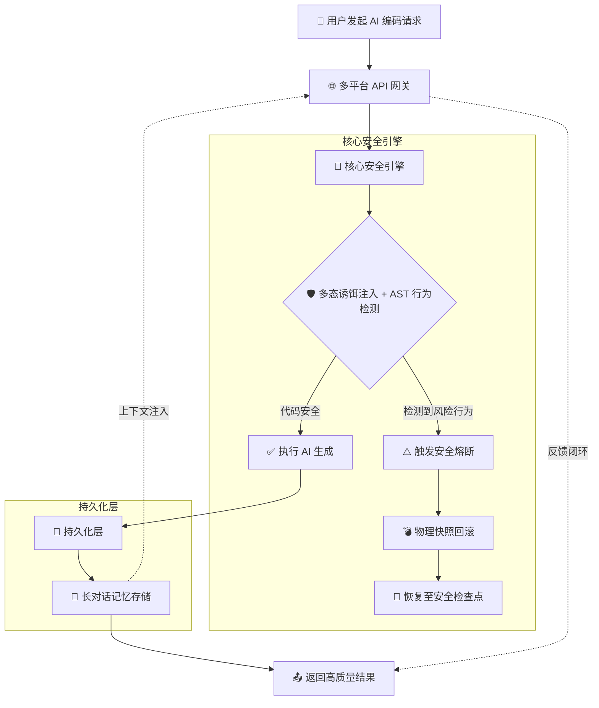
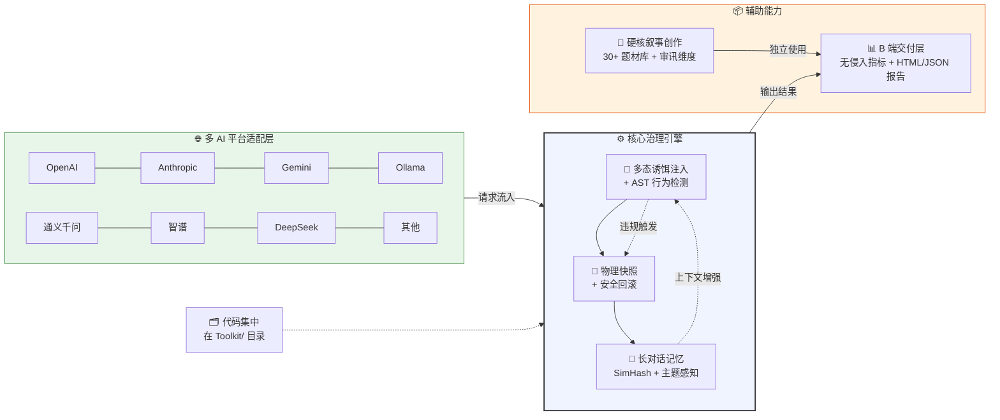

# 🛡️ Word 体系 —— 一个闲的没事干的人的库 V3.1

让 AI 按规矩干活，违规就回滚。一套可审计、可对抗、可落地的 AI 治理方案。

> ⚠️ **诚实声明**：本项目是作者业余时间的实验性工具集，部分功能为"够用即可"的实现，
> 不是企业级安全产品。使用前请阅读下方「局限性说明」。

---

## ✨ 核心能力一览

| 模块 | 功能 | 实现方式 | 准确率 |
|------|------|---------|--------|
| **gateway.py** | 统一网关（意图→Skill→模型→守门→飞轮） | Python | ✅ 高 |
| **work.py** | Python 代码守门（7 条规则） | **AST 解析** | ✅ 高 |
| **work.py** | 多语言代码检测（Java/Kotlin/TS/Swift） | **正则表达式** | ⚠️ 低（见局限） |
| **guardian.py** | 物理快照 + 安全回滚 | Python + shutil | ✅ 高 |
| **guardian.py** | 违规审计日志（RollbackJury） | 文件输出 | ✅ 高（本地） |
| **Archive.py** | 长对话记忆（SimHash） | Python | ✅ 中 |
| **shiyun.py** | 硬核叙事创作辅助 | Python | ✅ 高 |
| **Nuwa.py** | POC 报告 + 辐射检测 | Python + 正则 | ✅ 中 |
| **Proteus.py** | 统一交互入口 | Python | ✅ 高 |

---

## 📋 局限性说明（必读）

### 1. 多语言检测是正则，不是 AST

| 语言 | 检测方式 | 已知问题 |
|------|---------|---------|
| Python | ✅ 真 AST（`ast` 模块） | 无 |
| Java | ❌ 正则表达式 | 换格式漏检、注释误报、字符串误报 |
| Kotlin | ❌ 正则表达式 | `!!` 计数不精确、协程检测粗糙 |
| TypeScript | ❌ 正则表达式 | `any` 检测只看字面量、Promise 检测不递归 |
| Swift | ❌ 正则表达式 | `!` 计数不区分代码和注释 |

**结论**：非 Python 语言的检测仅作初步筛查，**不要用于生产环境的安全审计**。
未来计划引入 `tree-sitter` 做真 AST 解析。

### 2. 审计日志不具备防篡改能力

`RollbackJury` 生成的"判决书"包含 SHA-256 哈希，但这只是**本地完整性校验**，
不是密码学签名。任何人拿到文件都能重新计算哈希。
**如需防篡改，请配合外部签名服务（如 Sigstore）使用。**

### 3. 意图识别是轻量级

- 默认：关键词匹配（零训练，准确率低）
- 可选：安装 `sentence-transformers` 后自动升级为语义匹配
- 语义匹配也只是在本地 80MB 模型上跑，不是 GPT-4 级别的理解

### 4. Mock 模式已移除

V3.1 不再有"模型调用失败返回假数据"的逻辑。API 调用失败会直接抛
`ModelCallError`，明确告诉你哪里出了问题。**绝不拿假数据冒充 AI 输出。**

### 5. 反馈式重试

V3.1 的重试不再是"同一个 prompt 问 3 遍"。每次重试会把上一次的违规原因
注入到 prompt 里，让模型知道"哪里错了、怎么改"。

---

## ⚠️ 已知未解决问题（V3.2 诚实补丁）

> 以下问题是社区 audit 后发现的，作者**没有假装解决了**，这里逐条回应。

### ❓ 1. 多语言检测还是正则

**是的，没改。** Java/Kotlin/TypeScript/Swift 仍然是正则表达式。

**为什么不改**：`tree-sitter` 的 Python 绑定需要编译 C 扩展，跨平台安装不稳定。
作者不会发布"装都装不上"的功能。

**你作为用户该知道的**：
- 这些语言的检测**准确率很低**（估计 < 50%）
- 会漏检（换行就看不见）、会误报（注释里的代码也算）
- **不要用于生产环境的安全审计**

**什么时候改**：等 `tree-sitter` Python 绑定稳定，或作者找到不需要编译的方案。
跟踪进度见 `CHANGELOG.md` 的 Roadmap。

### ❓ 2. 没有真实项目验证

**是的，没做。** 当前 83/83 通过是手写 toy code 自测。

**为什么没做**：作者没有足够大的标注数据集（100+ 样本，含已知违规标记）。

**你能帮什么**：如果你有开源项目代码 + 已知的违规清单，欢迎提交到 `examples/datasets/`。

### ❓ 3. 准确率未知

**是的，不知道。** 没有标注数据集 → 无法计算 precision/recall/F1。

**本次新增**：`evaluate.py` 框架已写好，定义了 `BenchmarkDataset` 接口。
你只需要准备一个 JSON 文件：
```json
[
  {"code": "def f(x): pass", "expected_violations": ["type_hints"]},
  {"code": "key='sk-abc'", "expected_violations": ["no_hardcoded_secrets"]}
]
```
然后跑 `python evaluate.py your_dataset.json`，就能看到准确率数字。

### ❓ 4. Star 还是 1

**是的，没涨。** 代码改了，但没人知道。

**作者的态度**：不刷 star，不群发求赞。写好代码 → 推到 GitHub → 等人发现。
如果你用了觉得有用，点个 star 就是最大的帮助。

---

## 🏗️ 系统架构

### 核心安全引擎流程



### 系统整体架构



---

## 📁 目录结构

```
.
├── Toolkit/               # 🚀 所有核心模块
│   ├── __init__.py
│   ├── gateway.py        # 统一网关（V3.2 诚实版）
│   ├── work.py           # 核心守门（Python=AST / 其他=正则）
│   ├── guardian.py       # 快照回滚 + 审计日志
│   ├── Archive.py        # 长对话记忆（SimHash）
│   ├── shiyun.py        # 硬核叙事工厂
│   ├── Nuwa.py          # POC 报告 + 辐射检测
│   ├── Proteus.py       # 交互启动入口
│   └── skills/          # Skill 定义文件
├── examples/             # 📚 示例
│   ├── 01_basic_check.py       # 最小检测示例
│   ├── 02_snapshot_rollback.py # 快照回滚演示
│   ├── 03_full_gateway.py      # 完整网关调用
│   └── dataset/                 # 标注数据集
│       └── sample_dataset.json
├── config/               # 配置模板
│   └── config_template.json
├── config.json           # 本地配置（不提交！）
├── evaluate.py           # 📊 准确率评估框架
├── verify_real.py        # 🔍 真实项目扫描框架
├── verify.py             # ✅ 83 项单元测试
├── .gitignore           # 忽略运行时产物
├── requirements.txt      # Python 依赖
├── CHANGELOG.md         # 更新公告
├── CONTRIBUTING.md      # 🤝 贡献指南
├── README.md            # 本文档
└── LICENSE              # MIT
```

---

## 🚀 快速开始

### 1. 环境要求

- Python 3.10+
- pip

### 2. 安装依赖

```bash
pip install -r requirements.txt
```

依赖列表（`requirements.txt`）：

```
requests>=2.31.0
# 可选增强（按需安装）：
# sentence-transformers>=2.2.0  # 语义意图识别
# jieba>=0.42.1                  # 中文分词
# scikit-learn>=1.3.0             # 向量检索
```

### 3. 配置 API Key（环境变量方式）

```bash
export NUWA_AI_API_KEY=sk-你的真实key
export NUWA_AI_PROVIDER=deepseek   # 可选，默认 deepseek
export NUWA_ENV=dev                 # dev / test / prod
```

> ⚠️ **不要**在 `config.json` 中写入明文 API Key。
> `config.json` 已在 `.gitignore` 中，不会误提交。

### 4. 运行

```bash
cd Toolkit
python Proteus.py          # 交互式菜单
# 或
python gateway.py         # 命令行入口
```

---

## 🔧 各模块用法

### 行为守门（work.py）

```python
from Toolkit import work

code = """
def add(a, b):
    return a + b
"""

guard = work.InstinctGuard()
results = guard.check_all(code)
print(guard.summary(results))
```

### 快照回滚（guardian.py）

```python
from Toolkit import guardian

g = guardian.Guardian()
sid = g.create_snapshot(".")       # 创建快照
# ... AI 搞坏了你的代码 ...
g.rollback(sid, ".")              # 恢复到快照
```

### 审计日志（guardian.py → RollbackJury）

```python
from Toolkit.guardian import RollbackJury

jury = RollbackJury("verdicts")
v = jury.issue(
    rule_name="no_hardcoded_secrets",
    original_code='key = "sk-abc123..."',
    evidence={"pattern": "openai_key"},
    snapshot_id="snap-xxx",
    user="jincheng", env="prod", model="deepseek",
)
print(v.data["verdict_id"])  # V-20260715-xxxxxx
```

### 全栈辐射检测（Nuwa.py）

```python
from Toolkit.Nuwa import RadiationDetector

rd = RadiationDetector(".")
alerts = rd.scan("my_changed_file.py")
print(rd.generate_report(alerts))
```

---

## 🔌 支持的 AI 平台

| 平台 | 状态 | 说明 |
|------|------|------|
| OpenAI | ✅ 接口已写 | 需自行测试 |
| Anthropic | ✅ 接口已写 | 需自行测试 |
| Gemini | ✅ 接口已写 | 需自行测试 |
| Ollama | ✅ 本地可用 | 无需 API Key |
| 通义千问 | ✅ 接口已写 | 需自行测试 |
| 智谱 GLM | ✅ 接口已写 | 需自行测试 |
| DeepSeek | ✅ 最常用 | 推荐起步 |
| MiniMax | ✅ 接口已写 | 需自行测试 |
| 百川 | ✅ 接口已写 | 需自行测试 |
| 腾讯混元 | ✅ 接口已写 | 需自行测试 |

> ⚠️ 除 DeepSeek + Ollama 外，其他平台仅验证了请求格式正确，
> 未做端到端的功能测试。

---

## 🤝 客户痛点 vs 实际解法

| 客户原话 | 实际解法 | 诚实评级 |
|----------|---------|---------|
| "规则太死板" | PolicyEngine 三级策略（dev/test/prod） | ✅ 真有用 |
| "回滚了不知道为啥" | RollbackJury 生成审计记录（JSON+MD） | ✅ 真有用（但非防篡改） |
| "AI 不修表结构" | RadiationDetector 关联检查 | 🟡 基础够用 |
| "我们写 Java/Swift" | 多语言检测 | 🔴 正则版，仅筛查 |
| "想少写点代码" | Skill 推荐 + 反馈式重试 | ✅ 真有用 |

---

## 📄 许可证

MIT License —— 随便用，出事了别找我（开玩笑的，Issue 随时提）。

## 🙏 致谢

- `requests` —— 没有你就没有 HTTP
- `sentence-transformers` —— 让关键词匹配有了退路
- 所有 AI 服务商 —— 感谢提供 API（和偶尔的限流）

---

**让 AI 守规矩，从承认不完美开始。 🛡️**
