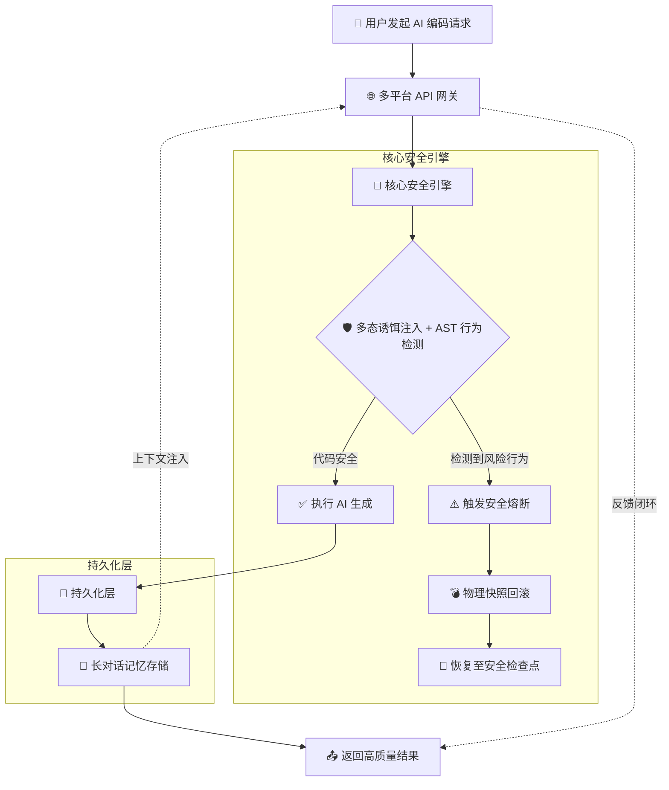
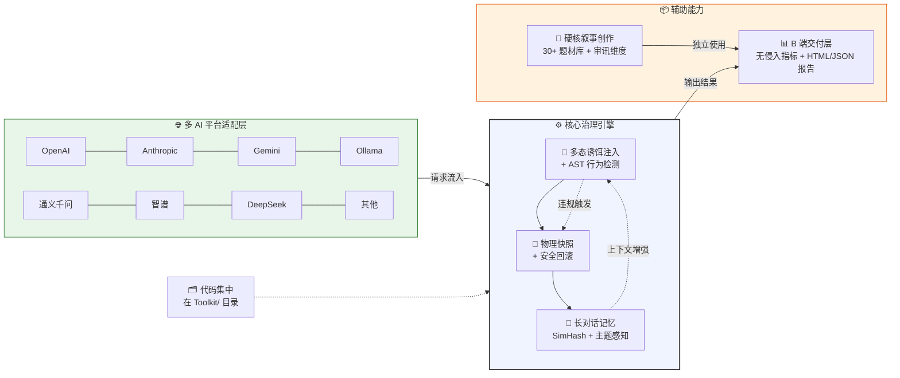

# jinchen —— 一个闲的没事干的人的库

**让 AI 按规矩干活，违规就回滚，翻车了能还原，聊久了不忘事。**

> 表面上看，这是一套"AI 治理工具集"。
> 实际上就干一件事：**帮你省 token。**

---

## 💰 这东西的本质是"省 Token"

很多人以为这个工具集是"AI 守门员""代码治理""叙事工厂"……

**都对，但都没说到点子上。**

每个模块的存在理由，翻译成人话都是同一句：

> **不把不需要的东西发给模型，不把同样的上下文发第二遍。**

| 模块 | 表面上是 | 本质上是（省 Token 逻辑） |
|------|---------|--------------------------|
| **Archive.py** | 长对话记忆 | 不把 10 轮历史全塞给模型，只挑最近相关的 3 条喂进去。**少发 40%~70% 的废话。** |
| **work.py** | 代码守门员 | 模型写出垃圾代码 → 直接拦下来 → 只告诉它"第 3 行少了 try-catch"。**不让它反复生成 200 行烂代码烧你钱。** |
| **shiyun.py（诗云）** | 硬核叙事工厂 | 不是"帮 AI 写小说"，是**用结构化场景卡（钩子/冲突/禁止项）喂 AI**，让它一次出好稿。**不靠"写一版我看看"碰运气，省掉反复改写的几万 token。** |
| **gateway.py** | 统一网关 | 意图识别 → 只加载相关 Skill → 只注入需要的规则。**不把 7 个 Skill 全塞进 system prompt 烧钱。** |
| **guardian.py** | 快照回滚 | 模型翻车了能一键还原，**不用重新生成一遍让 AI "再试试"。重试一次 = 又烧一轮 token。** |
| **RollbackJury** | 违规判决书 | 记录"为什么拦"→ 下次重试直接告诉模型原因。**不重发整段代码，只发差异。** |
| **Skill 按需加载** | 技能推荐 | 你要写 Python API → 只注入 `python_api_design.skill`。**不把 7 个 Skill 全塞进去白烧 token。** |
| **主题切换检测** | 话题感知 | 你从"写代码"切到"聊剧情" → 自动清空旧上下文。**不带着上一轮的垃圾继续烧。** |

### 数字说话

假设对话 10 轮后发第 11 次请求（写 Python 登录接口 + JWT + 刷新 token）：

| 环节 | 裸调 AI | 用这套工具 | 省 |
|------|---------|------------|-----|
| 上下文（10 轮历史） | ~8000 token | ~2500 token | **~5500** |
| Skill 注入（7 选 1~3） | ~2000（全塞） | ~500（按需） | **~1500** |
| 重试（发全文 vs 发差异） | ~800（重发全文） | ~30（只说哪里错） | **~770** |
| **单次请求合计** | **~10800** | **~3030** | **~7770** |

> 每次请求省 **~7770 token**
> DeepSeek 价格 ≈ 省 **0.02 元/次**
> 一天 100 次 = **2 元/天 = 60 元/月**
>
> **但真正值钱的不是这 60 块钱——是"模型一次出对"省下的那几个小时调试时间。**

---

## 📖 诗云（shiyun）省 Token 的逻辑，展开讲

诗云不是"AI 写小说工具"。它是：

**1. 30+ 题材库** → 不靠 prompt 里写 500 字背景设定，只给一个题材名 + 3 个钩子 + 3 个冲突 → **省 ~300 token/次**

**2. 维度审讯**（10 个必答问题）→ 先把"主角要什么/怕什么/秘密是什么"想清楚，再让 AI 写 → **不靠"你先写一版我看看"碰运气 → 省掉 3~5 轮来回改写 ≈ 省 ~5000 token**

**3. 场景卡（SceneCard）** → 刚性结构喂给 AI（POV/地点/目标/必须包含/绝对禁止/字数）→ **一次出稿率从 30% 提到 80%+ → 省掉反复修改的 token**

**4. 钩子管理 + 冲突附录** → 不靠"再写一段看看"碰运气 → **省 ~2000 token/章节**

翻译成人话：

> **诗云 = 先想清楚再动笔，不靠"写一版再说"烧 token 碰运气。**

---

## 🔧 怎么用最省？

```python
from Toolkit import Archive, gateway, shiyun

# 1. Archive 管上下文（自动裁剪，不重复发历史）
arch = Archive("my_session")
arch.remember("user", "写一个 Python 登录接口，要 JWT")
context = arch.context_inject("my_session", limit=3)

# 2. 网关自动 Skill 按需 + 反馈式重试（只发差异，不重发全文）
gw = gateway.WordGateway({"env": "dev"})
result = gw.handle("加上刷新 token 功能")

# 3. 诗云：先想清楚再写（不靠"写一版我看看"碰运气）
sy = shiyun.Shiyun()
card = sy.make_scene_card(
    scene_id="1-1",
    pov="金呈（第三人称有限）",
    location="朱墙内殿",
    goal="他发现自己今天起床时指尖是半透明的",
    must_include=["他对着镜子说'我是金呈，我还在'"],
    must_not=["任何'他感到恐惧'之类的直白心理描写"],
    output_hint="800-1200字，白描为主",
)
prompt = sy.scene_to_prompt(card)  # 结构化喂 AI，一次出好稿
```

详细示例见 `examples/04_token_saving.py`，跑一下直接看数字。

---

## 📋 完整功能一览

一句话：**你让 AI 写代码，它帮你盯着，不让它瞎搞。**

展开来说，这套工具集覆盖了 AI 辅助开发的全链路：

### 1. 代码守门（work.py）—— AI 写出来的东西，先过我这关

| 规则 | 干什么 | 怎么检测的 |
|------|--------|-------------|
| 类型注解检查 | 函数参数和返回值有没有标类型 | Python AST 解析 |
| 异常处理检查 | 涉及 IO/网络的操作有没有 try-catch | AST 扫描风险调用 |
| 硬编码密钥检查 | 有没有把 API Key 写死在代码里 | 正则 + AST 验证 |
| SQL 注入检查 | 有没有用字符串拼接拼 SQL | AST 追踪拼接路径 |
| Markdown 占位符检查 | AI 是不是偷懒写了 `[TODO]` | AST 遍历字符串字面量 |
| 无限递归检查 | 函数有没有终止条件 | AST 检测递归 + 终止判断 |
| 未使用导入检查 | import 了没用到的模块 | AST 遍历 Name/Attribute 引用 |

**每条规则都有三个动作可选**：`pass`（放行）、`regenerate`（让 AI 重写）、`rollback`（回滚到快照）。

### 2. 意图识别（gateway.py）—— 你说的啥，我先搞明白

你说"帮我写个 Python 登录接口"，系统会自动判断：

- 这是**写代码**还是**写小说**还是**改配置**？
- 该注入哪些规范？该调哪个 AI 平台？该用严格模式还是宽松模式？

支持两种模式：
- **关键词匹配**（零依赖，开箱即用）
- **语义匹配**（装了 `sentence-transformers` 自动升级）

### 3. Skill 推荐 —— 不把所有规矩一股脑塞给 AI

你有 7 个 Skill 文件，每个对应一种场景的编码规范：

| Skill | 管什么 |
|-------|--------|
| `python_api_design` | Python API 接口设计规范 |
| `error_handling` | 异常处理最佳实践 |
| `sql_safety` | SQL 安全写法 |
| `code_refactor` | 代码重构原则 |
| `markdown_format` | 文档格式规范 |
| `interactive_ux` | 交互体验设计 |
| `fiction_writing` | 小说创作规范 |

**不是全塞进去**，而是根据你说的需求，**只挑相关的 2~3 个**注入到 prompt 里。省 token，也省 AI 的注意力。

### 4. 快照回滚（guardian.py）—— AI 搞坏了代码？一键还原

每次让 AI 改代码之前，**先拍照**：

```
修改前 → 创建快照（zip 压缩整个目录）
         ↓
    AI 改代码
         ↓
   守门检测 → 通过？→ 保留
         ↓ 不通过
   自动回滚 → 恢复到拍照时的状态
```

### 5. 违规判决书（RollbackJury）—— 每次回滚都有完整记录

不是默默回滚就完了，而是**自动生成一份《违规判决书》**：

```markdown
# ⚖️ 违规判决书 `V-20260715-143022-a3f1`

| 字段 | 值 |
|------|---|
| 时间 | 2026-07-15T14:30:22 |
| 用户 | jincheng |
| 环境 | prod |
| AI 模型 | deepseek-coder |
| 违规规则 | `no_hardcoded_secrets` |
| 严重等级 | **CRITICAL** |

## 📋 违规代码
key = "sk-1234567890abcdef12345678"

## 🔧 修复建议
import os
api_key = os.getenv("API_KEY")
```

### 6. 长对话记忆（Archive.py）—— 聊 100 轮也不失忆

用 **64 位 SimHash** 做语义指纹，解决 AI 长对话的三个痛点：

| 痛点 | 解法 |
|------|------|
| 聊久了 AI 忘记开头说了啥 | SimHash 分块存储，按需注入最近 N 条 |
| 话题突然切换，AI 还在答上一题 | 主题切换检测：汉明距离超阈值 → 自动重置 |
| 用户说"紧急！生产崩了"，AI 不当回事 | 紧急度检测：关键词触发，标记优先级 |

### 7. POC 报告（Nuwa.py）—— 给老板/客户看的东西

自动生成两种格式的报告：
- **HTML 报告**：带样式，直接浏览器打开
- **JSON 报告**：结构化数据，方便接入 CI/CD

### 8. 全栈辐射检测（Nuwa.py）—— 改了一个地方，看看还有哪些要跟着改

| 检测维度 | 检查什么 |
|---------|---------|
| DB 辐射 | SQL 改了 → 检查 migrations/ 有没有对应迁移 |
| API 辐射 | 路由改了 → 检查 docs/ 有没有更新接口文档 |
| 测试辐射 | 函数改了 → 检查 tests/ 有没有对应测试 |
| 导入辐射 | 模块改了 → 检查谁在 import 它 |
| 配置辐射 | 环境变量改了 → 检查 .env.example |

### 9. 10+ AI 平台适配 —— 换个模型不改代码

| 平台 | 类型 | 说明 |
|------|------|------|
| DeepSeek | 云端 | 推荐起步，性价比高 |
| OpenAI | 云端 | GPT 系列 |
| Anthropic | 云端 | Claude 系列 |
| Gemini | 云端 | Google 的模型 |
| 通义千问 | 云端 | 阿里 |
| 智谱 GLM | 云端 | 清华系 |
| Ollama | **本地** | 跑在自己机器上，零成本 |
| MiniMax / 百川 / 腾讯混元 | 云端 | 国产大模型 |

切换平台只改一行配置，网关代码不用动。

### 10. 反馈式重试 —— 不是同一个问题问三遍

之前的做法：违规了 → 同样的 prompt 再发一次 → 得到同样的结果 → 白费。

现在的做法：违规了 → **把违规原因注入 prompt** → "你的代码第 3 行少了 try-catch，请修复" → AI 知道哪里错了 → 重新生成 → 大概率通过。

### 11. 反馈飞轮 —— 每次犯错都记下来，攒够了能训练

每次违规 + 修复都记录到 `feedback.jsonl`，攒够了可以导出成 **SFT 训练数据**，用来微调你自己的模型。

### 12. 统一交互入口（Proteus.py）—— 零门槛使用

不想写代码？直接跑 `Proteus.py`，弹出菜单：

```
╔══════════════════════════════════════════╗
║          🛡️ jinchen 工具集启动器          ║
╚══════════════════════════════════════════╝

  [1] 🔧 行为约束检测（work）
  [2] 💾 快照管理（guardian）
  [3] 🧠 长对话记忆（Archive）
  [4] 📖 叙事创作（shiyun）
  [5] 📊 POC 报告（Nuwa）
  [6] 🌐 完整网关（gateway）
  [q] 退出

👉 选择:
```

---

## 🏗️ 系统架构

### 核心安全引擎流程



### 系统整体架构



---

## 📁 目录结构

```
jinchen/
├── Toolkit/                      # 🚀 所有核心模块
│   ├── __init__.py
│   ├── gateway.py                # 统一网关（意图→Skill→模型→守门→飞轮）
│   ├── work.py                   # 核心守门（8 条 AST 规则）
│   ├── guardian.py               # 快照回滚 + 审计日志（RollbackJury）
│   ├── Archive.py                # 长对话记忆（SimHash 64位）
│   ├── shiyun.py                # 硬核叙事工厂（30+ 题材库）
│   ├── Nuwa.py                  # POC 报告 + 辐射检测
│   ├── Proteus.py               # 交互启动入口（菜单式）
│   └── skills/                  # Skill 定义文件（7 个）
│       ├── python_api_design.skill
│       ├── error_handling.skill
│       ├── sql_safety.skill
│       ├── code_refactor.skill
│       ├── markdown_format.skill
│       ├── interactive_ux.skill
│       └── fiction_writing.skill
├── examples/                     # 📚 使用示例
│   ├── 01_basic_check.py        # 最小检测示例
│   ├── 02_snapshot_rollback.py  # 快照回滚演示
│   ├── 03_full_gateway.py       # 完整网关调用
│   ├── 04_token_saving.py       # 💰 省 Token 演示
│   └── dataset/                 # 标注数据集
│       └── sample_dataset.json
├── config/                       # 配置模板
│   └── config_template.json
├── evaluate.py                   # 📊 准确率评估框架
├── verify_real.py                # 🔍 真实项目扫描框架
├── verify.py                     # ✅ 82 项单元测试
├── config.json                   # 本地配置（不提交！）
├── .gitignore                   # 忽略运行时产物
├── requirements.txt              # Python 依赖
├── CHANGELOG.md                 # 更新公告 + 架构图
├── CONTRIBUTING.md              # 🤝 贡献指南
├── README.md                    # 本文档
└── LICENSE                      # MIT
```

---

## 🚀 快速开始

### 1. 环境要求

- Python 3.10+
- pip

### 2. 安装依赖

```bash
pip install -r requirements.txt
```

依赖列表（`requirements.txt`）：

```
requests>=2.31.0
# 可选增强（按需安装）：
# sentence-transformers>=2.2.0  # 语义意图识别（80MB 模型，离线运行）
# jieba>=0.42.1                  # 中文分词
# scikit-learn>=1.3.0             # 向量检索
```

### 3. 配置 API Key

```bash
export NUWA_AI_API_KEY=sk-你的真实key
export NUWA_AI_PROVIDER=deepseek   # 可选，默认 deepseek
export NUWA_ENV=dev                 # dev / test / prod
```

> ⚠️ **不要**在 `config.json` 中写入明文 API Key。
> `config.json` 已在 `.gitignore` 中，不会误提交。

### 4. 运行

```bash
cd Toolkit
python Proteus.py          # 交互式菜单（推荐新手）
# 或
python gateway.py         # 命令行入口
```

### 5. 跑省 Token 演示

```bash
python examples/04_token_saving.py
```

直接看数字：每次请求省多少 token，换算成多少钱。

---

## 🔧 各模块用法

### 行为守门（work.py）

```python
from Toolkit import work

code = """
def add(a, b):
    return a + b
"""

guard = work.InstinctGuard()
results = guard.check_all(code)
print(guard.summary(results))
```

### 快照回滚（guardian.py）

```python
from Toolkit import guardian

g = guardian.Guardian()
sid = g.create_snapshot(".")       # 创建快照
# ... AI 搞坏了你的代码 ...
g.rollback(sid, ".")              # 恢复到快照
```

### 审计日志（guardian.py → RollbackJury）

```python
from Toolkit.guardian import RollbackJury

jury = RollbackJury("verdicts")
v = jury.issue(
    rule_name="no_hardcoded_secrets",
    original_code='key = "sk-abc123..."',
    evidence={"pattern": "openai_key"},
    snapshot_id="snap-xxx",
    user="jincheng", env="prod", model="deepseek",
)
print(v.data["verdict_id"])  # V-20260715-xxxxxx
```

### 长对话记忆（Archive.py）

```python
from Toolkit import Archive

arch = Archive("my_session")
arch.remember("demo", "帮我写 Python 登录接口", role="user")
arch.remember("demo", "好的，这是代码...", role="assistant")

# 下次请求只注入最近 3 条（不重复发历史）
context = arch.context_inject("demo", limit=3)
# 自动检测话题切换、紧急度、短输入
```

### 硬核叙事创作（shiyun.py）

```python
from Toolkit import shiyun

sy = shiyun.Shiyun()

# 随机选题材
genre = sy.random_genre()
print(f"题材: {genre}")
print(f"钩子: {sy.generate_hooks(genre)}")
print(f"冲突: {sy.list_conflicts(genre)}")

# 做一张场景卡（结构化喂 AI，一次出好稿）
card = sy.make_scene_card(
    scene_id="1-1",
    pov="金呈（第三人称有限）",
    location="朱墙内殿",
    goal="他发现自己今天起床时指尖是半透明的",
    must_include=["他对着镜子说'我是金呈，我还在'"],
    must_not=["任何'他感到恐惧'之类的直白心理描写"],
    output_hint="800-1200字，白描为主",
)
prompt = sy.scene_to_prompt(card)
# 把这个 prompt 发给 AI → 一次出稿率 80%+
```

### 全栈辐射检测（Nuwa.py）

```python
from Toolkit.Nuwa import RadiationDetector

rd = RadiationDetector(".")
alerts = rd.scan("my_changed_file.py")
print(rd.generate_report(alerts))
```

### 完整网关（gateway.py）

```python
from Toolkit.gateway import WordGateway

config = {
    "env": "dev",
    "skill_dir": "Toolkit/skills",
    "user": "jincheng",
}
gw = WordGateway(config)

result = gw.handle("帮我写一个 Python 登录接口")
print(result.model_output)       # AI 生成的代码
print(result.guard_summary)      # 守门检测结果
print(result.skills_used)        # 用了哪些 Skill
print(result.retries)            # 重试了几次
```

---

## 🎯 动态策略引擎（dev / test / prod）

同一套代码，三种严格度，**环境变量一行切换**：

| 环境 | 检查范围 | 最大重试 | 严格模式 |
|------|---------|---------|---------|
| **dev** | 只卡安全红线（密钥 + SQL 注入） | 1 次 | 关 |
| **test** | 加代码质量（类型注解 + 递归 + 导入） | 2 次 | 关 |
| **prod** | 全部 8 条规则 | 2 次 | **开**（警告也拦截） |

```bash
export NUWA_ENV=prod   # 切换环境，立刻生效
```

---

## 🌐 支持的 AI 平台

| 平台 | 状态 | 说明 |
|------|------|------|
| OpenAI | ✅ 接口已写 | 需自行测试 |
| Anthropic | ✅ 接口已写 | 需自行测试 |
| Gemini | ✅ 接口已写 | 需自行测试 |
| Ollama | ✅ 本地可用 | 无需 API Key |
| 通义千问 | ✅ 接口已写 | 需自行测试 |
| 智谱 GLM | ✅ 接口已写 | 需自行测试 |
| DeepSeek | ✅ 最常用 | 推荐起步 |
| MiniMax | ✅ 接口已写 | 需自行测试 |
| 百川 | ✅ 接口已写 | 需自行测试 |
| 腾讯混元 | ✅ 接口已写 | 需自行测试 |

> ⚠️ 除 DeepSeek + Ollama 外，其他平台仅验证了请求格式正确，
> 未做端到端的功能测试。

---

## ⚠️ 局限性说明（必读）

### 1. 多语言检测是正则，不是 AST

| 语言 | 检测方式 | 已知问题 |
|------|---------|---------|
| Python | ✅ 真 AST（`ast` 模块） | 无 |
| Java | ❌ 正则表达式 | 换格式漏检、注释误报、字符串误报 |
| Kotlin | ❌ 正则表达式 | `!!` 计数不精确、协程检测粗糙 |
| TypeScript | ❌ 正则表达式 | `any` 检测只看字面量、Promise 检测不递归 |
| Swift | ❌ 正则表达式 | `!` 计数不区分代码和注释 |

**结论**：非 Python 语言的检测仅作初步筛查，**不要用于生产环境的安全审计**。
未来计划引入 `tree-sitter` 做真 AST 解析。

### 2. 审计日志不具备防篡改能力

`RollbackJury` 生成的"判决书"包含 SHA-256 哈希，但这只是**本地完整性校验**，
不是密码学签名。任何人拿到文件都能重新计算哈希。

**如需防篡改，请配合外部签名服务（如 Sigstore）使用。**

### 3. 意图识别是轻量级

- 默认：关键词匹配（零训练，准确率低）
- 可选：安装 `sentence-transformers` 后自动升级为语义匹配
- 语义匹配也只是在本地 80MB 模型上跑，不是 GPT-4 级别的理解

### 4. Mock 模式已移除

API 调用失败会直接抛 `ModelCallError`，明确告诉你哪里出了问题。
**绝不拿假数据冒充 AI 输出。**

---

## 🤝 客户痛点 vs 实际解法

| 客户原话 | 实际解法 | 诚实评级 |
|----------|---------|---------|
| "规则太死板，开发不想查注解" | PolicyEngine 三级策略（dev/test/prod） | ✅ 真有用 |
| "回滚了不知道为啥" | RollbackJury 生成判决书（JSON+MD） | ✅ 真有用（非防篡改） |
| "AI 不修表结构" | RadiationDetector 关联检查 | 🟡 基础够用 |
| "我们写 Java/Swift" | 多语言检测 | 🔴 正则版，仅筛查 |
| "想少写点代码" | Skill 推荐 + 反馈式重试 | ✅ 真有用 |
| "AI 聊久了就失忆" | SimHash 长对话记忆 + 主题切换检测 | ✅ 真有用 |
| "AI 写小说没深度" | 30+ 题材库 + 审讯维度 + 场景卡 | ✅ 真有用 |
| **"AI 太费 token 了"** | **全模块协同省 Token（见上方计算）** | ✅ **核心价值** |

---

## 📄 许可证

MIT License —— 随便用，出事了别找我（开玩笑的，Issue 随时提）。

## 🙏 致谢

- `requests` —— 没有你就没有 HTTP
- `sentence-transformers` —— 让关键词匹配有了退路
- 所有 AI 服务商 —— 感谢提供 API（和偶尔的限流）

---

**让 AI 守规矩，从承认不完美开始。 🛡️**

**顺便帮你省 token —— 不烧不该烧的，就是赚到的。** 💰
